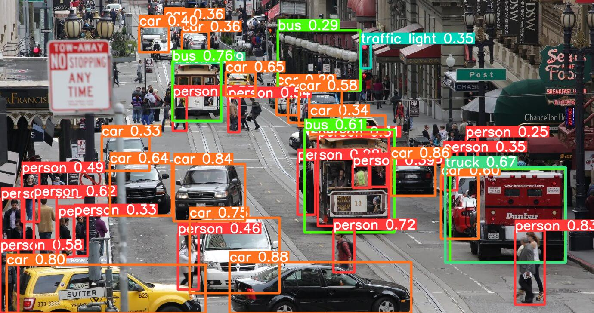

# Object Detection and Image Cropping Project
This project focuses on performing object detection using a pretrained YOLOv5s model. Following the detection, the script crops the original image based on the model's outputs, isolating the predicted objects.

## Usage
Run the main.py script to execute supporting scripts that perform object detection and create two folders:

- runs folder: Contains labeled images with predicted bounding boxes.

- Cropped_images folder: Contains images of the predicted objects cropped from the original image.

## Orignal sample

## Predicted Sample

## Cropped samples

  
  
  

